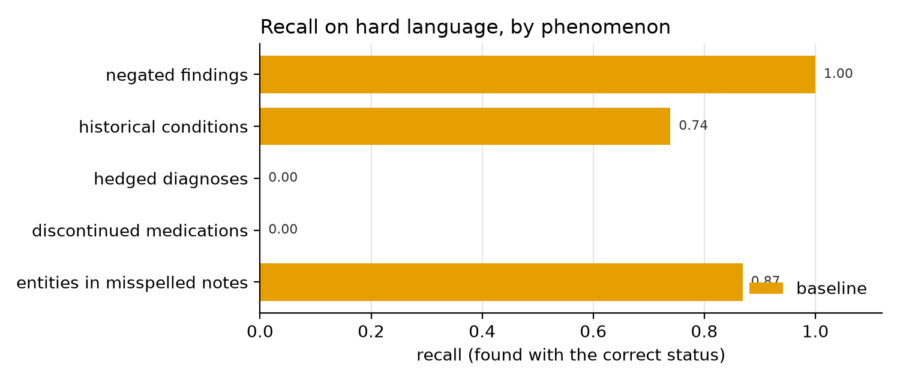
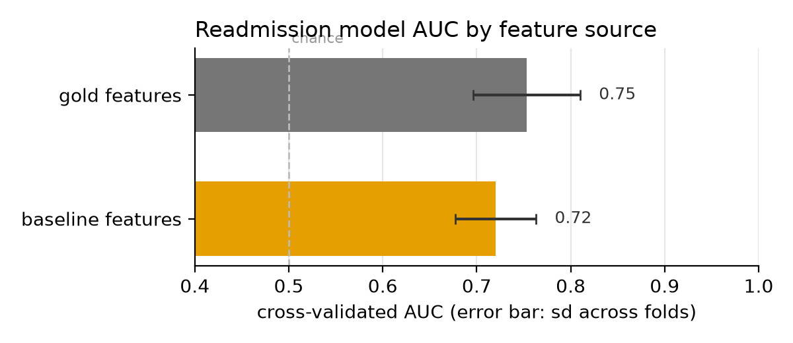

# clinical-notes-llm-extraction

A generative AI extraction pipeline over synthetic clinical notes: an LLM with
schema-constrained output turns unstructured doctors' notes into analysis-ready
data, is scored against exact ground truth and against a rule-based baseline,
and the extracted features are then used the way a real project would use them,
for descriptive statistics and a predictive model. Unit tests and continuous
integration throughout.

I built this because my extraction experience is with structured research data
(REDCap, imaging, CDISC), not free-text clinical notes, and I wanted a working,
measurable example of the LLM-as-extractor pattern: not "ask a chatbot", but a
pipeline with a typed schema, cached prompts, committed raw outputs, and an
evaluation that says exactly where the model is better than rules and by how
much. Everything here is synthetic; no real patient data is involved at any
point.

## Why synthetic notes

Real clinical notes cannot go in a public repo, and hand-labeling someone
else's corpus reintroduces label noise. Here the corpus generator and the gold
labels come from the same random draws, so ground truth is exact by
construction. The generator ([notesynth/generator.py](notesynth/generator.py))
writes 150 outpatient notes in two formats (sectioned and narrative) and
deliberately injects the language that breaks dictionary methods:

- negated findings ("denies chest pain")
- historical conditions ("hospitalized for pneumonia in 2008, resolved")
- medications discontinued in prose ("we discontinued metformin today because
  of GI upset"), which never appear in the medication list
- hedged diagnoses ("possible early COPD")
- abbreviations (HTN, T2DM, afib) and occasional misspellings
- family history and allergy distractors that must not be attributed to the
  patient

Each note records which of these phenomena it contains, so evaluation can
report recall per phenomenon rather than one blended number.

## Method

1. **Generate** ([scripts/10_generate_notes.py](scripts/10_generate_notes.py)):
   150 seeded synthetic notes plus gold labels for conditions (with status
   active, historical, negated, or suspected), medications (with dose and
   active or discontinued status), smoking status, follow-up interval, and A1c.
   Each synthetic patient also gets a 30-day readmission outcome drawn from a
   logistic model of the true features.
2. **Baseline** ([extraction/baseline.py](extraction/baseline.py)): dictionary
   lookup with a NegEx-style negation window (Chapman et al., 2001) and
   medication-list parsing. Written to be fair, not a strawman; its dictionary
   is the generator's own vocabulary, which is the best case for rules.
3. **LLM extraction** ([extraction/llm.py](extraction/llm.py)): one Claude API
   call per note through `client.messages.parse()`, with the Pydantic schema in
   [extraction/schema.py](extraction/schema.py) constraining the output shape
   server-side. The instructions are prompt-cached; only the note text changes
   between calls. Raw extractions are committed, so scoring is reproducible
   without an API key.
4. **Evaluate** ([extraction/evaluate.py](extraction/evaluate.py)): entity
   precision/recall/F1 by normalized name, status and dose accuracy on matched
   entities, scalar-field accuracy, and recall sliced by phenomenon.
5. **Downstream** ([scripts/50_downstream.py](scripts/50_downstream.py)): the
   part that usually gets skipped. The same logistic regression predicts
   readmission three times, changing only where the features come from (gold
   labels, LLM extractions, baseline extractions). The AUC gap measures what
   extraction errors cost the analysis built on top.

## Results

The LLM extraction run is pending (step 3 below); the committed outputs
currently cover the rule-based baseline. The baseline's headline numbers look
strong, and that is exactly the trap this design is meant to expose.

| metric | baseline |
|---|---|
| conditions F1 | 0.975 |
| condition status accuracy | 0.984 |
| medications F1 | 0.924 |
| smoking / follow-up / A1c accuracy | 1.00 |

Sliced by phenomenon, the picture changes
([outputs/metrics.json](outputs/metrics.json)):

| recall on | baseline |
|---|---|
| negated findings | 1.00 |
| historical conditions | 0.74 |
| entities in misspelled notes | 0.87 |
| hedged diagnoses | **0.00** |
| discontinued medications | **0.00** |



The rules handle what they were written for (negation, lists) and miss what
they were not: nothing in a dictionary finds a medication stopped in prose or
downgrades "possible early COPD" to a suspected diagnosis.

**Downstream, those misses are not cosmetic.** The true rate of a medication
being stopped at the visit is 44%; the baseline reports 0%, a descriptive
statistic that is simply wrong. In the readmission model, gold features give a
cross-validated AUC of 0.75 and baseline features 0.72, because the stopped
medication signal, a real risk factor in the simulation, is invisible to the
rules.



## Run it

```bash
python3 -m venv .venv && source .venv/bin/activate
pip install -r requirements.txt
python -m pytest -q        # tests are offline; no API key needed
./run_all.sh               # generate -> baseline -> (LLM) -> evaluate -> figures
```

The LLM step needs `ANTHROPIC_API_KEY` set (about 150 short calls; the default
model is set in [extraction/llm.py](extraction/llm.py)). Every other step runs
offline from committed files.

## Limitations

- The corpus is synthetic and template-based, so it is easier than real
  clinical text on both sides: the baseline benefits from a closed vocabulary,
  and the LLM benefits from clean grammar. Absolute numbers will not transfer
  to real notes; the phenomenon-level contrasts (what rules miss, what the LLM
  misses) are the transferable part.
- The baseline's dictionary is the generator's own vocabulary. Against real
  notes a rules system would also fight vocabulary coverage, so the baseline
  here is an upper bound for this class of method.
- The readmission outcome is generated from the gold features, so the gold-AUC
  ceiling is by construction; the interesting quantity is the drop from that
  ceiling for each extractor, not the ceiling itself.
- Entity matching is by normalized name per note, which is enough here because
  the generator never emits the same condition twice with different statuses.
  Real notes need span-level matching.
- One extraction call per note, no batching. For a corpus that does not fit a
  weekend budget, the Batches API halves the cost.

## References

Agrawal, M., Hegselmann, S., Lang, H., Kim, Y., & Sontag, D. (2022). Large
language models are few-shot clinical information extractors. *Proceedings of
the 2022 Conference on Empirical Methods in Natural Language Processing*,
1998-2022. https://doi.org/10.18653/v1/2022.emnlp-main.130

Chapman, W. W., Bridewell, W., Hanbury, P., Cooper, G. F., & Buchanan, B. G.
(2001). A simple algorithm for identifying negated findings and diseases in
discharge summaries. *Journal of Biomedical Informatics, 34*(5), 301-310.
https://doi.org/10.1006/jbin.2001.1029
